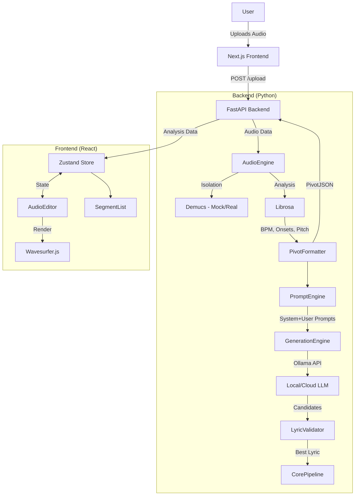

# 🏗️ Flow-to-Lyrics Architecture

**Last Updated**: 2025-12-28  
**Version**: 2.1 (Post Syllable Detection Overhaul)  
**Context**: Technical documentation for "Flow-to-Lyrics" MVP.

---

## 🔭 High-Level Overview

**Flow-to-Lyrics** is a full-stack application designed to transform raw vocal flows (mumbling/yaourt) into rhythmic lyrics.  
It operates on a **Python Backend** (audio processing, LLM generation & lyric validation) and a **Next.js Frontend** (interactive visualization).

### 📐 Architecture Diagram



---

## 🛠️ Tech Stack & Components

### 1. Backend Service (`/`)
**Role**: Audio Processing, DSP, LLM Integration, and Validation.  
**Tech**: Python 3.10+, FastAPI, Librosa, Demucs, g2p_en, Requests.

| File | Type | Lines | Responsibilities |
|------|------|-------|------------------|
| `main.py` | API Entry | ~223 | FastAPI app, CORS, `/upload` endpoint, temp file mgmt. |
| `audio_engine.py` | DSP Core | ~1200 | **DemucsProcessor**: Vocal isolation.<br>**LibrosaAnalyzer**: Adaptive onset detection (spectral + energy), BPM, pitch.<br>**PivotFormatter**: Stress/sustain/pitch detection, segment splitting, breath filtering. |
| `prompt_engine.py` | Translator | ~351 | Converts PivotJSON → LLM prompts with stress/sustain/pitch guidance. |
| `generation_engine.py` | LLM Brain | ~421 | Ollama HTTP integration (local + cloud), JSON parsing. |
| `validator.py` | Gatekeeper | ~365 | g2p_en phonetic validation, syllable counting, groove scoring. |
| `core_pipeline.py` | Orchestrator | ~422 | End-to-end pipeline: Audio → Prompts → LLM → Validation. |
| `config.py` | Config | ~211 | Centralized `.env` loading, type-safe config access. |
| `phase0_blind_test.py` | Legacy | ~362 | Original standalone test script (Phase 0). |

### 2. LLM Prompt Templates (`/prompts`)

| File | Purpose |
|------|---------|
| `system_instruction.md` | Persona, rules, and few-shot examples for the LLM. |
| `user_template.md` | Jinja2-style template with placeholders: `{{syllable_count}}`, `{{stress_pattern}}`, `{{pitch_guidance}}`, `{{sustain_constraints}}`. |

### 3. Frontend Application (`/frontend`)
**Role**: User Interface, Visualization, and Interaction.  
**Tech**: Next.js 14, React, TypeScript, Tailwind CSS, Wavesurfer.js 7, Zustand.

| Path | Type | Lines | Responsibilities |
|------|------|-------|------------------|
| `app/page.tsx` | Page | ~100 | Main UI layout, integrates `AudioEditor` + `SegmentList`. |
| `components/AudioEditor.tsx` | Component | ~527 | Waveform via Wavesurfer.js, region rendering, drag-drop upload, keyboard controls. |
| `components/SegmentList.tsx` | Component | ~164 | Data table with segment info, bi-directional sync with waveform. |
| `store/useAudioStore.ts` | State | ~138 | Zustand store: `analysisData`, playback, zoom, active/hovered segment. |
| `lib/api.ts` | Utility | ~48 | Typed API client for backend communication. |

### 4. Test Suite (`/tests`)

| File | Coverage |
|------|----------|
| `test_audio_analysis.py` | Stress/sustain detection in `audio_engine.py` |
| `test_prompt_engine.py` | Prompt generation from PivotJSON |
| `test_generation.py` | Ollama integration, mock mode |
| `test_end_to_end.py` | Full pipeline: Audio → LLM → Validation |
| `test_precision_tuning.py` | Onset detection parameter calibration |

---

## 🔄 Data Pipeline

The system revolves around a **Pivot JSON** structure that normalizes audio data for the frontend and generation engine.

### Pipeline Flow

```
Audio File → Demucs → Librosa Analysis → PivotJSON → PromptEngine → LLM → Validator → Best Lyric
```

1.  **Ingestion**: User uploads audio (MP3/WAV/M4A/FLAC/OGG) → `main.py`
2.  **Processing** (`audio_engine.py`):
    *   **DemucsProcessor**: Isolates vocals (or mocks it in dev mode)
    *   **LibrosaAnalyzer**: Detects `onsets`, `tempo`, and prepares for pitch tracking
    *   **PivotFormatter**: Detects stress (RMS amplitude), sustain (duration), pitch contour
3.  **Formatting**: Converted into **Pivot JSON**:
    ```json
    {
      "meta": { "tempo": 123.05, "duration": 11.65 },
      "blocks": [{
        "id": 1, 
        "syllable_target": 5,
        "segments": [
          { 
            "time_start": 0.5, 
            "duration": 0.2, 
            "is_stressed": true,
            "is_sustained": false,
            "pitch_contour": "mid"
          }
        ]
      }]
    }
    ```
4.  **Prompt Generation** (`prompt_engine.py`): Translates PivotJSON to LLM prompts
5.  **LLM Generation** (`generation_engine.py`): Sends prompts to Ollama, parses JSON response
6.  **Validation** (`validator.py`): Filters by syllable count, calculates groove score
7.  **Visualization**: Frontend receives JSON → Zustand → Wavesurfer renders regions

---

## ⚙️ Configuration

All configuration is centralized in `config.py` and loaded from `.env`:

| Variable | Default | Description |
|----------|---------|-------------|
| `OLLAMA_MODEL` | `ministral-3:8b` | LLM model name |
| `OLLAMA_URL` | `http://localhost:11434` | Ollama API endpoint |
| `OLLAMA_TEMPERATURE` | `0.7` | Generation creativity (0.0-1.0) |
| `OLLAMA_TIMEOUT` | `60` | Request timeout in seconds |
| `OLLAMA_API_KEY` | *(empty)* | API key for cloud Ollama |
| `MOCK_MODE` | `true` | Skip Demucs for development |
| `ONSET_DELTA` | `0.05` | Onset detection sensitivity (lower = more) |
| `ONSET_USE_ENERGY` | `true` | Enable energy-based fallback detection |
| `MAX_SEGMENT_DURATION` | `1.0` | Max segment length before splitting |
| `ONSET_WAIT` | `1` | Min frames between onsets |
| `API_HOST` | `0.0.0.0` | Server host |
| `API_PORT` | `8000` | Server port |
| `MAX_FILE_SIZE_MB` | `100` | Max upload size |

### Phonetic Analysis (Allosaurus)

| Variable | Default | Description |
|----------|---------|-------------|
| `PHONETIC_ENABLED` | `true` | Enable IPA phoneme extraction |
| `PHONETIC_MIN_DURATION` | `0.10` | Min segment duration for analysis (seconds) |
| `PHONETIC_PADDING` | `0.05` | Context padding on each side (seconds) |
| `PHONETIC_RETRY_PADDING` | `0.10` | Expanded retry padding when first attempt fails |
| `PHONETIC_FALLBACK_ENABLED` | `true` | Enable `[vowel]`/`[consonant]` fallback |

> [!WARNING]
> **Known Issue:** Allosaurus phoneme recognition is inaccurate for mumbled/sung vocals. Detection rate is ~83%, but accuracy is low. See [PHONETIC_ACCURACY_ISSUE.md](./PHONETIC_ACCURACY_ISSUE.md) for details and recommended Phase C solution (Whisper integration).

---

## 📂 Directory Structure

```text
Lyrics.ai/
├── main.py                     # 🚀 FastAPI Entry & File Upload
├── audio_engine.py             # 🧠 Audio Processing (Demucs + Librosa + Pitch)
├── prompt_engine.py            # ✍️ PivotJSON → LLM Prompts
├── generation_engine.py        # 🤖 Ollama LLM Integration
├── validator.py                # ✅ g2p_en Phonetic Validation
├── core_pipeline.py            # 🔗 End-to-End Orchestrator
├── config.py                   # ⚙️ Centralized Configuration
├── phase0_blind_test.py        # 🧪 Legacy Validation Script
├── requirements.txt            # 📦 Python Dependencies
├── .env / .env.example         # 🔐 Environment Variables
├── prompts/                    # 📝 LLM Prompt Templates
│   ├── system_instruction.md   #    Persona + few-shot examples
│   └── user_template.md        #    User prompt with placeholders
├── tests/                      # 🧪 Test Suite
│   ├── test_audio_analysis.py
│   ├── test_prompt_engine.py
│   ├── test_generation.py
│   ├── test_end_to_end.py
│   └── test_precision_tuning.py
├── audio samples/              # 🎵 Test audio files
├── docs/                       # 📚 Documentation
│   ├── ARCHITECTURE.md         #    This file
│   ├── PROJECT_STATUS.md       #    Status tracking
│   ├── NEXT_PHASES.md          #    Technical roadmap
│   ├── PHASE1_PRECISION_CHANGELOG.md
│   └── prd.md                  #    Original PRD
└── frontend/                   # 🖥️ Next.js Application
    ├── app/                    #    App Router Pages
    ├── components/             #    React UI Components
    │   ├── AudioEditor.tsx     #    Waveform Editor
    │   └── SegmentList.tsx     #    Segment Data Table
    ├── lib/                    #    Utilities (API client)
    └── store/                  #    Zustand State Store
```

---

## 🔌 API Endpoints

| Method | Endpoint | Description |
|--------|----------|-------------|
| `GET` | `/` | Health check (returns status, mock_mode, llm_model) |
| `GET` | `/health` | Detailed health check (includes all config) |
| `POST` | `/upload` | Upload audio file, returns PivotJSON |

---

## 🎯 Key Data Structures

### Segment (Backend)
```python
@dataclass
class Segment:
    time_start: float
    duration: float
    is_stressed: bool = False
    is_sustained: bool = False
    pitch_contour: str = "mid"  # low, mid, high, rising, falling
    audio_phonemes: str = ""    # IPA from Allosaurus
```

### GenerationResult (Backend)
```python
@dataclass
class GenerationResult:
    candidates: list[str]           # All 5 LLM options
    validations: list[ValidationResult]
    best_line: Optional[str]        # Auto-selected winner
    best_score: float               # Groove score (0.0-1.0)
    metadata: dict                  # tempo, duration, stress_pattern, pitch_pattern
    pivot_json: Optional[PivotJSON]
```

### ValidationResult (Backend)
```python
@dataclass
class ValidationResult:
    is_valid: bool
    score: float
    reason: str
    syllable_count: int
    phonemes: list[str]
    stress_markers: list[int]
```
